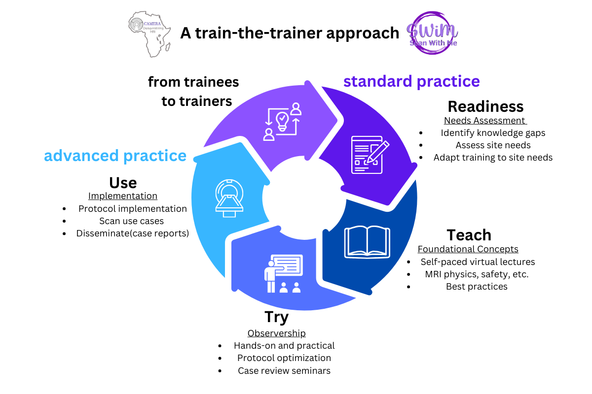

# SCAN WITH ME (SWiM) 2023 Program Schedule

The 2023 SWiM Program focused on cardiac MRI (CMR) scanning. All training, including live demos on CMR, were delivered through the SWiM Program training platform (https://event.fourwaves.com/swim). The course materials available on this repository are those approved to be publicly shared by the faculty.  

**Program Objectives:**
1. Build standard skills in MR imaging techniques.
2. Upscale and advance the MRI knowledge of technologists practicing in resource limited settings.
3. Implement standard MRI protocols and best practices adapted for optimal imaging in resource limited settings. 
4. Train and retrain imaging experts who will sustainably advance the practice of MRI in LMICs.
5. Create a collaborative culture and a network of imaging experts in LMICs. 

**Program Structure:** The program was completed in 3 modules 

  

1. **Teach - Two-weeks Virtual Foundation Course on CMR. (August 22nd to September 2nd, 2023) - 20 hrs.**  
Learn the basics.   Two-week self-paced online learning experience supported by live tutorials on Saturdays to discover fundamentals in MR imaging and image analysis relevant to CMR.    
2. **Try - Two Week Hybrid Observership (September 5th to September 16th, 2023) - 20 hrs.**  
Scan with an expert. Observe live demos with a team of expert technologists and try out your hands on acquiring high quality images, analyze images, and explore advanced MRI (e.g., BMORE) techniques. This is supported by daily seminars, networking opportunities, and team building capstone projects. The seminars provide conceptual information on CMR, focusing on image quality and the role of CMR for the indication. The capstone projects enabled each team to work together to address one goal (e.g., optimize protocols or work on case reports).   
3. **Use - Two weeks Practicum (September 26th to October 7th, 2023) - 16 hrs.**  
Scan as an expert. Apply skills gained during the foundation and observership modules and to scan 1-2 volunteers or cardiac patients on your scanner. This module is supported by hands-on best practices demonstrations to help learners apply their skills. Teams work together to implement the imaging protocol they reviewed for their capstone project on their scanner and present their case report. 

**Training Materials**
 

|    |   Topic Title   |   Faculty    |  Date  |
| :---------: | ------------- | ------------- |  -----|
|     |   **Foundational Module – Week 1: Introduction to CMR**  |   |  |
|  1   |  [Introduction to MRI Physics for CMR 1](https://github.com/CAMERA-MRI/SWiM/blob/main/Training%20Materials/CMR-2023/Week%201/Day%201%20content%20description.md) |   | August 22nd 2023 |
|  2   |   [Introduction to MRI Physics for CMR 2](https://github.com/CAMERA-MRI/SWiM/blob/main/Training%20Materials/CMR-2023/Week%201/Day%202%20content%20description.md)   |   | August 23rd 2023 |
| 3   |  [Virtual CMR Scanning with SiemensHealthineers](https://youtu.be/-f6yZN6epes) | Dr. Gaia Banks and Stephanie Koch - SIEMENS Healthineers, Erlangen, Germany  | August 23rd 2023 |
|  4  |   [Cardiac Anatomy and Physiology for CMR](https://github.com/CAMERA-MRI/SWiM/blob/main/Training%20Materials/CMR-2023/Week%201/Day%203%20content%20description.md)  |   |  August 24th 2023 |
|  5  |   [CMR Safety I, artefacts, and imaging with devices and pregnant women](https://github.com/CAMERA-MRI/SWiM/blob/main/Training%20Materials/CMR-2023/Week%201/Day%204%20content%20description.md)  |   |  August 25th 2023  |
|  6  |  [Weekend Tutorial and Group Exercise: Introduction to CMR Assignment](https://youtu.be/Lm3X7yAG3GA) |  Dr. Abdul Nashirudeen Mumuni, Harrison Aduluwa, Francis Botwe   |  August 26th 2023  |
|     |   **Foundational Module – Week 2: Applications of CMR**  |   |  |
|  1   |   [CMR Acquisition and Image processing basics](https://github.com/CAMERA-MRI/SWiM/blob/main/Training%20Materials/CMR-2023/Week%202/Day%201%20content%20description.md)   |   | August 29th 2023 |
|  2  |   [CMR imaging techniques (CINE, LGE, and perfusion imaging)](https://github.com/CAMERA-MRI/SWiM/blob/main/Training%20Materials/CMR-2023/Week%202/Day%201%20content%20description.md)  |   | August 29th 2023 |
|  3  |   [Quantitative CMR Imaging (Parametric mapping): T1 mapping, T2 mapping, ECV assessment, Image Post -Processing and analysis](https://github.com/CAMERA-MRI/SWiM/blob/main/Training%20Materials/CMR-2023/Week%202/Day%202%20content%20description.md) |  |  August 30th 2023 |
|  4  |  [CMR normal appearance and pathologies](https://github.com/CAMERA-MRI/SWiM/blob/main/Training%20Materials/CMR-2023/Week%202/Day%203%20content%20description.md)  |     |   August 31st 2023 |
|  5  |  [Advanced CMR: O2-Sensitive CMR](https://github.com/CAMERA-MRI/SWiM/blob/main/Training%20Materials/CMR-2023/Week%202/Day%204%20content%20description.md)  |     |  September 1st 2023  |
|  6 | [CMR for Radiography I - Introduction to CMR with Philips - French](https://youtu.be/hkxfmNI8_RA)  | Dr. Abderrazek Zeraii - Higher Institute of Medical Technologies of Tunis, Tunis, Tunisia  |  August 30th 2023 |
|  7  |[ Weekend Tutorial and Group Exercise: Applications of CMR Assignment](https://youtu.be/oZVdN0SvtuM)  |  Surendra Maharjan and Harrison Aduluwa |  September 2nd 2023   |  
|  |  **Observership Module - Week 1** |   |   |
|  1  |  CMR II for Radiography: CMR Acquisition, Protocols, and Planning (French)  |   Dr. Abderrazek Zeraii - Higher Institute of Medical Technologies of Tunis, Tunis, Tunisia  |  September 5th 2023  |
|  2  | [CMR Flow and Myopathies](https://youtu.be/uLVN_6JPilo)  | Dr. Muhammad Umair - Johns Hopkins Hospital, Baltimore, Maryland, USA | September 5th 2023 |
|  3  |  [Myocardial Stress with CMR](https://youtu.be/RAhcNwifNfE) | Dr. Matthias Friedrich MD - Division of Experimental Medicine, McGill University, Montreal, Canada | September 6th 2023 |
|  4  | [CMR Rapid Protocol: From Research to Practice](https://www.youtube.com/watch?v=2GeMcEebX9k)  | Dr. Katia Menacho Medina - Barts Heart Centre, Saint Bartholomew's Hospital, London, UK  | September 7th 2023 |
|  5  | [Circle CVI-42 demo](https://youtu.be/r6Zhy5MGcaw)  |  Anne Hui Sze Kwong - Circle Cardiovascular Imaging, Strasbourg, France/Calgary, AB, Canada| September 8th 2023 |
|  6  | [O2-Sensitive CMR Live Demo I – Scanning](https://youtu.be/pwbA0aTa5Z8)  |  Dr. Katerina Eyre - Division of Experimental Medicine, McGill University, Montreal, Canada | September 9th 2023 |
|  7  |  [Group Exercise: Develop an MRI Screening form and Safety Policy](https://github.com/CAMERA-MRI/SWiM/tree/main/Training%20Materials/CMR-2023/Week%203)  |     |  September 9th 2023  |
|  |  **Observership Module - Week 2** |   |   |
|  1  |  [How to write a Case Report](Case_Report_Guideline-1.pdf)  |     |  September 16th 2023   |
|  2  |  [Myocardial Fibrosis](https://youtu.be/7oZpLiR2UjU) | Dr. Olukayode (Solomon) Aremu - Cape Heart Institute, Department of Medicine, University of Cape Town, South Africa  | September 12th 2023 |
|  3  |  [Cardiac MRI in Evaluation of Post-operative TOF](https://youtu.be/YYayNiVZ1oQ) | Dr. Nirmal Prasad Neupane - Shahid Gangalal National Heart Centre, Kathmandu, Nepal |September 13th 2023  |
|  4  |  [CMR IV For Radiography: Flow, mapping & Vessel imaging](https://youtu.be/_HxHvJjv8Mc) | Dr. Abderrazek Zeraii - Higher Institute of Medical Technologies of Tunis, Tunis, Tunisia  | September 14th 2023 |
|  5  | [CMR Rapid Protocol: Applications in Cardiamyopathies](https://youtu.be/I_xLXMfCUD4)  | Dr. Katia Menacho Medina - Barts Heart Centre, Saint Bartholomew's Hospital, London, UK | September 14th 2023 |
|  6  |  [CMR Safety and Contraindications](https://youtu.be/yhELmWPm8ww) | Dr. Ives Levesque - Gerald Bronfman Department of Oncology & Medical Physics Unit, McGill University, Montreal, Canada  | September 15th 2023 |
|  7  | [O2-Sensitive CMR  Demo II  - Analysis](https://youtu.be/Xp34_VkwWUQ)   | Dr. Katerina Eyre - Division of Experimental Medicine, McGill University, Montreal, Canada  | September 16th 2023 |
|  8  |  Group Exercise: CMR Case study: MR Scan Simulator and Analysis on CVI42  |     |  September 16th 2023  |
|  |  **Practicum Module – Week 1** |   |   |
|  1 | [Circle CVI-42 Live Demo:  4D Flow](https://youtu.be/Fa8pt2Ca_ek)  |  Anne Hui Sze Kwong - Circle Cardiovascular Imaging, Strasbourg, France/Calgary, AB, Canada | September 28th 2023 |
|  2  |  Group Exercise: CMR protocol and parameter optimization   |     |    |
|  |  **Practicum Module – Week 2** |   |   |
|  1  |  Canon Medical Live Demo   |   Dr. Chia-Ying Liu, Ela Chamera, Dr. Yoko Kato, Dr. Bharath Ambale Venkatesh, Dr. Chikara Noda - Canon and John Hopkins Hospital, Baltimore, Maryland, USA  |  October 3rd 2023  |
|  2  | [CMR Artefacts](https://youtu.be/cFg9nqmqWPk)  | Nerissa Naidoo - Advanced Imaging, Durban, South Africa | October 4th 2023 |
|  3  |  Siemens South Africa CMR Safety Practicum  |   Patricia Solomons - Siemens Healthcare Proprietary Limited, Cape Town, South Africa  |  October 5th 2023  |
|  4  |  Group Exercise: Case Report and Capstone Presentation   |     |  October 7th 2023  |
